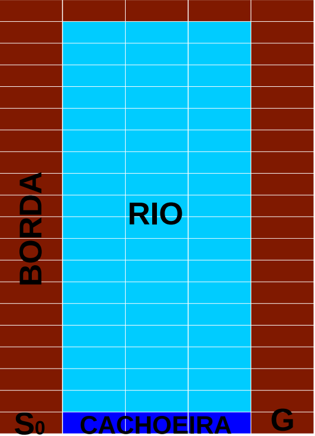

# Relatório 1

## Objetivo

    Avaliação de algoritmos para MDPs

## Algoritmos

- [x] Algoritmo clássico: Value Iteration ou Policy Iteration
- [x] Algoritmo eficiente: LAO*, LRTDP ou MCTS
- [ ] Variação da literatura do algoritmo anterior escolhido

## Problema

    Travessia do Rio

## Instâncias

- 5x25
- 20x100
- 50x250

## Avaliação

- tempo
- memória
- acesso a transições
- etc

## Formato de entrega

    Relatório

## Travessia do rio

<table border="0">
 <tr>
    <td><b>Borda: </b>resultado das açoes são deterministas</td>
    <td rowspan="4">
 </tr>
 <tr>
    <td><b>Rio: </b>por causa da correnteza sempre há uma chance de ir na direção da cachoeira.</td>
 </tr>
  <tr>
    <td><b>Cachoeira:</b> volta para o estado inicial</td>
 </tr>
 <tr>
    <td><b>Decisão relevante: </b>quando cruzar o rio?</td>
 </tr>
</table>

## Descrição dos Problemas

- **Função de transição**
  - Um arquivo action_XX.txt por ação
  - Cada linha no arquivo indica: estado origem, estado destino, probabilidade de transição

- **Função recompensa**
  - Um arquivo cost.txt com ao custos para cada estado
  - sempre custo 1 com exceção da meta (custo 0)

- **Semântica dos estados**
  - numerados de 1 até Nx*Ny
  - s = x*(Nx-1) + y
  - note que a borda a esquerda são os primeiros estados

- **Estado inicial**
  - Pode experimentar com valores arbitrários
  - S=1 pode favorecer LAO*, LRTDP, MCTS
  - S=Ny desfavorece esses algoritmos

- **Heurística**
  - Pode ser independente do ambiente
  - Mas, pode aproveitar a estrutura para definir heurísticas